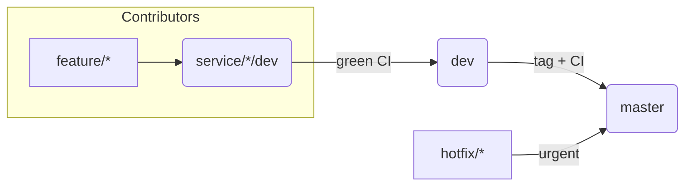

# Contributing to KizunaTravelOS

Thank you for helping build an open-source ERP for travel agencies!  
We welcome code, docs, tests, infra, UX—anything that improves the project.

---

## 1. Code of Conduct
We follow the **Contributor Covenant v2.1**.  
All contributors must respect the rules in `CODE_OF_CONDUCT.md`.  
Report violations to **contact@yaba-it.be**.

---

## 2. Repository layout

apps/            ← runnable services & SPA
packages/        ← shared JS libraries
infra/           ← Terraform, Helmfile, Argo CD, K8s bases
scripts/         ← helper CLI & dev tooling
docs/            ← architecture, ADRs, runbooks
.github/         ← CI / CD workflows, issue templates
docker-compose.yml  ← local dev stack
.tool-versions      ← language runtimes pin 

**Rule of thumb**  
 *If your change touches only one entry in `apps/` or `packages/`, work in that sub-tree and open a PR to its service branch.*  
 *If it touches cross-cutting infra (e.g. `infra/`) or docs, open a PR straight to `dev`.*

---

## 3. Branching model



| Branch pattern      | Purpose                              | Merge conditions                                |
|---------------------|--------------------------------------|-------------------------------------------------|
| **master**          | Production-ready code                | 1 review + full-stack CI green                  |
| **dev**             | Integration (all apps & packages)    | Full-stack CI green                             |
| **service/&lt;name&gt;/dev** | Team branch per app/micro-service      | Unit/integration tests + Docker build green     |
| **feature/&lt;slug&gt;**   | Single feature / bug fix                 | PR → matching *service/*/dev* branch            |
| **hotfix/&lt;slug&gt;**    | Critical prod patch                       | PR → `master`, minimal tests, back-merge to dev |

*Un-tick “Include administrators” in branch-protection rules so maintainers can bypass when necessary.*

---

## 4. Technology stack (pinned)

| Layer / Tool                    | Version |
|---------------------------------|---------|
| Node.js (all JS services)       | 20.19.3 |
| Yarn (classic)                  | 1.22.22 |
| Express + MongoDB (ERP API)     | Mongo LTS |
| Node + TypeORM + PostgreSQL     | Postgres 15 |
| Strapi CMS                      | latest stable |
| React 18 + Vite (SPA)           | — |
| Terraform                       | 1.8 + |
| Helm / Helmfile                 | 3.x |
| Argo CD                         | 2.x |

---

## 5. Pull-request workflow

1. Pick or open an Issue.  
2. Create a branch:  
   ```bash
   git checkout -b feature/456-add-booking-module
   ```
3. Write tests first (Jest/Mocha for Node, Vitest for SPA).  
4. Local check:  
   ```bash
   # ERP API
   cd apps/erp-api
   yarn install
   yarn test

   # Accounting service
   cd apps/accounting-svc
   yarn install
   yarn test

   # Web front-end
   cd apps/web
   yarn install
   yarn test
   ```
5. Push and open the PR to the correct *service/&lt;name&gt;/dev* branch.

*One PR = one focused change.*

---

## 6. Commit style

We use **Conventional Commits** (no emojis).

`feat(accounting): add invoice migration`  
`fix(erp-api): patch insecure JWT middleware`  
`chore(ci): bump Node to 20.19.3`

Every PR description must include `Fixes #NNN` or `Closes #NNN`.

---

## 7. Tests & CI

* **ERP / Accounting / Packages**: Jest or Mocha with ≥ 80 % coverage per service.  
* **Web SPA**: Vitest + React-Testing-Library.  
* **Strapi**: strapi-test-utils.  
* **CI matrix** lives in `.github/workflows/ci-backend.yml` and `ci-frontend.yml`.  
* Preview deploys to Netlify for `apps/web` on every PR.

---

## 8. Lint & formatting

* Node/TS: ESLint (Airbnb) + Prettier (`yarn lint`).  
* Shared packages must export type definitions.  
* Pre-commit hooks in `.husky/` are **required** (run `yarn prepare` once after clone).

---

## 9. Static analysis

* TypeScript strict mode for every TS file.  
* ESLint security plugin for Node.  
* `scripts/dev-up.sh` lints Terraform (`tflint`) and Helm charts (`helm lint`).

---

## 10. Documentation & labels

* API docs auto-generated: **OpenAPI** (`apps/erp-api/helm/chart.yaml`) and **Typedoc** for shared packages.  
* Site built with **MkDocs** → `docs/`.  
* Friendly labels: **good first issue**, **help wanted**, **documentation**, **infra**.  
* Architectural decisions stored in `docs/adr/`.

---

## 11. License

KizunaTravelOS is released under the **MIT License** (see `LICENSE`).  
The name “KizunaTravelOS” is free to use with attribution—no trademark reservation.

---

## 12. Maintainers

| Path / Area                     | GitHub owner    |
|---------------------------------|-----------------|
| Root, CI/CD, Infra              | @Farid212       |
| `apps/erp-api/`                 | @Farid212       |
| `apps/accounting-svc/`          | @Farid212       |
| `apps/cms/`                     | @Farid212       |
| `apps/web/`                     | @Farid212       |
| `packages/`                     | @Farid212       |

Maintainers may merge once **CI is green and ≥ 1 review** is approved, or override in emergencies.

---

*Happy coding and safe travels!*  
